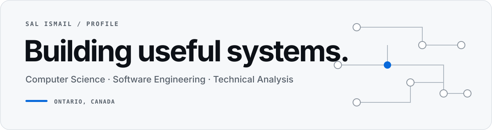

# Sal Ismail

**Computer Science Student · Software Engineer · Technical Analyst**

I build software products, automated systems, and data-driven tools that solve practical technical problems.

My work focuses on understanding complex systems, designing reliable solutions, and turning ideas into production-ready applications.

 

## Selected Work

### [CANAGI](https://www.canagi.me/)

An interactive Canadian labour market explorer covering 516 occupations. Compare careers and career fields, filter by pay and training requirements, and explore employment, projected labour shortages, and experimental AI exposure estimates through interactive treemaps. Includes official source references and occupation-level evidence behind the estimates.

**Focus:** React · TypeScript · Python · Data Visualization · Labour Market Data · Vercel

[Live site](https://www.canagi.me/) · [Source code](https://github.com/ranbysal/CANAGI)

### [Tracepoint](https://github.com/ranbysal/tracepoint)

An AI support incident console for diagnosing API failures, normalizing request telemetry, and producing evidence-backed technical escalations. Includes a live OpenAI Responses API probe, deterministic incident classification, synthetic failure scenarios, and Python triage tooling.

**Focus:** TypeScript · Next.js · Python · OpenAI API · HTTP · Incident Triage · Support Automation

[Source code](https://github.com/ranbysal/tracepoint)

### [Nuvamin Platform](https://nuvamin.bio/)

A full-stack commerce platform featuring backend workflows, order management, transactional systems, and operational tooling.

**Focus:** Node.js · Express · Redis · APIs · Backend Architecture

[Live site](https://nuvamin.bio/) · [Source code](https://github.com/ranbysal/Nuvamin)

### Voltis

A real-time futures analysis workspace combining interactive charting, market-data services, technical analysis tools, and cloud-based workflows.

**Focus:** TypeScript · Next.js · Python · APIs · WebSockets · System Design

 

## Technical Focus

**Languages**  
JavaScript · TypeScript · Python · SQL

**Software Development**  
React · Next.js · Node.js · REST APIs · WebSockets · Testing

**Systems & Delivery**  
Git · GitHub · Cloud Deployment · Documentation · Automation

**Data & Analysis**  
Data Processing · Reporting · Workflow Design · System Analysis

 

## Currently Building

- Production-quality software projects
- Automated workflows and technical systems
- Data-driven applications
- Stronger foundations in software architecture and computer science

 

## Connect

🌐 Portfolio: https://salismail.dev  
📍 Ontario, Canada

